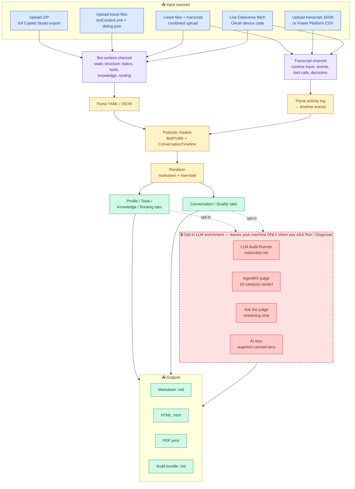
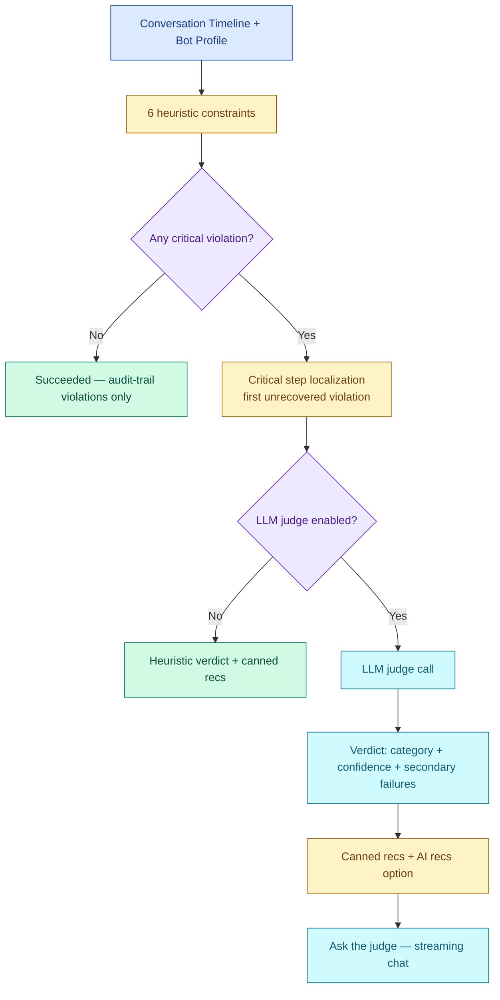
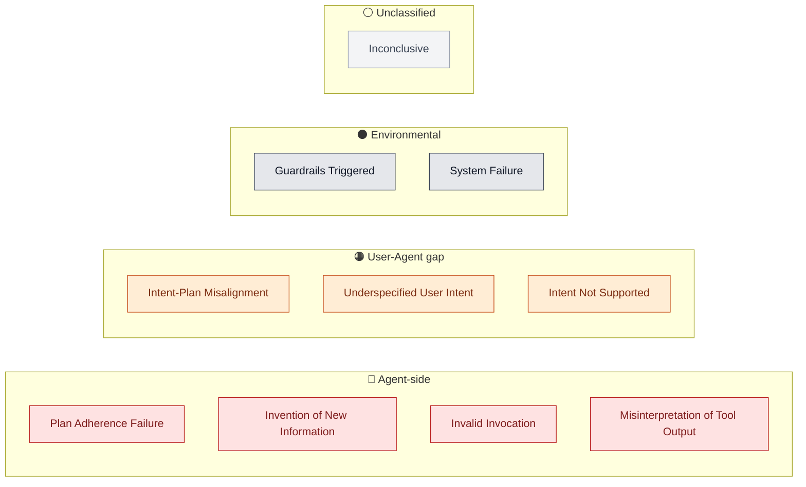
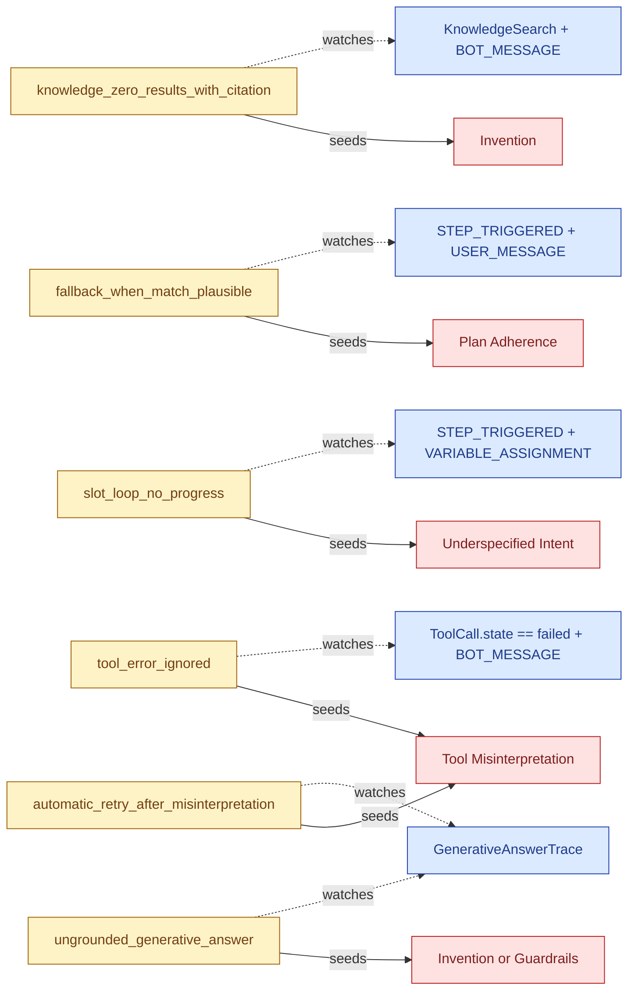
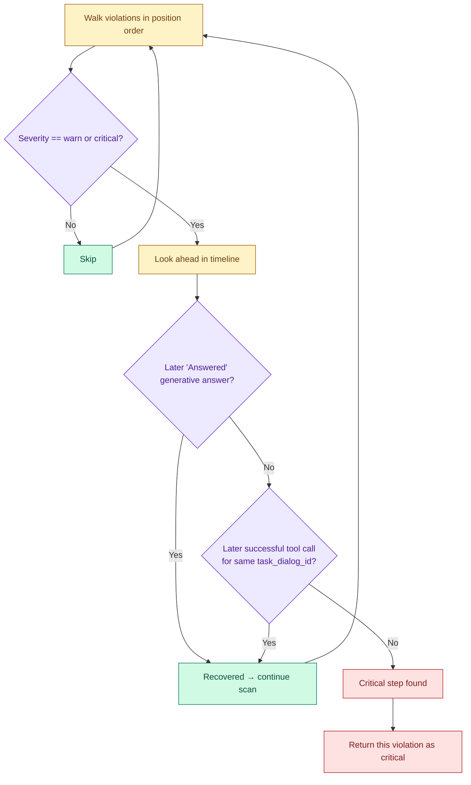

# Agent Analyser


# TLDR
**Peek under the hood of your Copilot Studio agents.** Upload a bot export, drop a conversation transcript, or connect straight to Dataverse — instantly see what your agent is actually doing under the hood: how the orchestrator routes decisions, which topics/tools/agents fire and why, where knowledge searches hit or miss, how long each step takes, and what falls through the cracks. Architecture reports, best-practice rules, trigger overlap detection, execution timelines, credit estimates, response quality scoring, and instruction compliance checking.

Everything you need to build with confidence and debug without guessing. If you're serious about Copilot Studio development, this belongs in your toolkit.


## Contents

- [Why Agent Analyser](#why-agent-analyser)
- [What You Can Do](#what-you-can-do)
- [How data flows through it](#how-data-flows-through-it)
- [Quick Start](#quick-start)
- [Dynamic Analysis Tabs](#dynamic-analysis-tabs)
- [What It Extracts](#what-it-extracts)
- [Tool Call Analysis](#tool-call-analysis)
- [Rules engine](#rules-engine)
- [Report Structure](#report-structure)
- [Exports](#exports)
- [Dataverse Connection](#dataverse-connection)
- [AI-powered features](#ai-powered-features)
  - [LLM Audit Runner](#llm-audit-runner)
  - [Failure Diagnosis (AgentRX)](#failure-diagnosis-agentrx)
- [Deployment](#deployment)
- [Development](#development)
- [Project Structure](#project-structure)
- [License](#license)

## Why Agent Analyser

- **Your data stays yours** — runs locally or self-hosted in your own tenant. No data is sent externally (except to OpenAI/Anthropic if you opt into the LLM Audit Runner)
- **Full visibility into bot architecture** — see every topic, variable, knowledge source, MCP server, connector, and connected agent, and how they wire together, in one report
- **Conversation debugging** — chat-style conversation flow with filter chips, error banner, deep-link hyperlinks, plan-tree grouping, and per-event raw-JSON viewer
- **Performance insights** — per-turn efficiency metrics, latency bottleneck identification, between-activity gap waterfall, knowledge source effectiveness, and multi-agent delegation tracing
- **Conversation quality analysis** — response groundedness scoring, hallucination risk detection, instruction compliance checking, and dead code detection
- **Works with exports and live Dataverse** — upload a `.zip` export, or connect directly to your environment and auto-analyse on login
- **Catch issues with AI-powered linting of agent instructions** — multi-mode audit runner (Static Config + opt-in Conversation Summary / Sentiment / PII / Answer Accuracy / Topic Routing / Custom prompts) powered by OpenAI or Anthropic
- **AgentRX-style failure diagnosis** — root-cause attribution into 10 categories with critical-step localization, secondary findings, and a streaming chat panel to interrogate the verdict

## What You Can Do

| Feature | Description |
| --- | --- |
| **Upload bot export** | Drop a `.zip`, or `botContent.yml` + `dialog.json` — get a full architecture report with quick wins |
| **Connect to Dataverse** | Device-code auth to your environment, auto-analyses your bot the moment you connect |
| **Routing analysis** | Orchestrator decision timeline with routing scores, topic lifecycles with redirect tracking, trigger phrase similarity, plan evolution diffs with thrashing detection |
| **Conversation transcripts** | Upload JSON, import a Power Platform CSV collection, or fetch transcripts from Dataverse — sequence diagrams, batch analytics, event logs, per-turn efficiency and latency breakdown |
| **Single conversation lookup** | Fetch and analyse a specific conversation by ID directly from Dataverse |
| **Response quality scoring** | Groundedness assessment for every bot response — detects ungrounded answers, hallucination risk from zero-result searches, and silently swallowed tool errors |
| **Instruction alignment** | Checks if the bot's runtime behavior matches its system instructions — language compliance, escalation triggers, scope restrictions |
| **Dead code detection** | Cross-references bot components against runtime evidence to find topics, tools, and knowledge sources that are never used |
| **Knowledge effectiveness** | Per-source hit rate, contribution rate, and error tracking — identifies knowledge sources that never contribute to grounded answers |
| **Multi-agent delegation** | Traces orchestrator-to-agent delegation chains — detects dead agents, always-failing agents, and shows orchestrator reasoning per delegation |
| **Latency bottlenecks** | Per-turn time breakdown showing where time is spent (thinking, tools, knowledge, delivery) with bottleneck flagging |
| **Plan evolution diffs** | Structured diffs between consecutive orchestrator plans within a turn — detects thrashing, scope creep, and re-planning patterns |
| **Batch analytics** | Aggregate multiple Dataverse transcripts — success/failure/escalation rates, topic usage, error patterns, credit estimates |
| **Custom rules** | 18 default best-practice rules + user-defined YAML rules, evaluated during analysis |
| **Tool call analysis** | Runtime tool call tracing — per-tool statistics, async chain detection, orchestrator reasoning, Mermaid flow diagrams. Supports MCP servers, connectors, child/connected agents, A2A, flows, CUA |
| **Component Explorer** | Inline searchable picker over every topic and tool (User / System / Automation topics, MCP servers, connectors, flows, child / connected / A2A agents) with KB-sourced explanations per setting |
| **LLM Audit Runner** | Multi-mode audit (default + opt-in: conversation summary / sentiment / PII / answer accuracy / topic routing / custom prompts) — runs in parallel via OpenAI or Anthropic |
| **Failure Diagnosis (AgentRX)** | AgentRx-style root-cause diagnosis: 10-category taxonomy, 6 heuristic rules, LLM judge with confidence + secondary findings, streaming chat-with-judge, HITL exchange surfacing in the Conversation Flow |
| **Exports** | Markdown / HTML / Print → PDF / Audit-bundle downloads — every dynamic-page surface (Variable Tracker, Performance Waterfall, Citation Verification, etc.) is reflected in the exports |
| **Dark / Light mode** | Respects your OS preference, green accent theme throughout |
| **Analysis counter** | Tracks how many analyses you've run, with cat-themed gamification milestones |

## How data flows through it

Five ways to get data in, two channels of data, one parsing pipeline, optional LLM enrichment, four export formats. Nothing leaves your machine unless you explicitly click an LLM action — the dashed box below is the only network boundary.



**Two data channels, not one.** *Bot content* is the static structure of your agent (topics, tools, knowledge sources, routing config). *Transcript* is a runtime trace of what actually happened in a conversation. Either alone gets you partial coverage:

- **Bot content alone** → Profile, Tools, Knowledge, Routing tabs are full. Conversation + Quality tabs are empty.
- **Transcript alone** → Conversation tab renders, but most cross-cutting analysis (dead-code, knowledge effectiveness, multi-agent delegation) needs the static config to compare against.
- **Both together** → full report, including cross-references between runtime evidence and static config (e.g. *"this topic is defined but never triggered"*, *"this knowledge source is queried but never contributes a citation"*).

A live Dataverse fetch always pulls both — it grabs `bot` + `botcomponent` (bot content) and `conversationtranscript` (transcripts) in one go.

**Opt-in LLM enrichment.** The dashed cyan box is the only place your data hits an external API. Parsing, heuristic rules, rendering, exports — all local. The LLM Audit Runner needs your own OpenAI / Anthropic key; the AgentRX judge + chat reuse it. **Off by default.** When you do turn them on, PII redaction (emails, phones, IBAN, BSN, credit-card numbers, names) is on by default for the AgentRX judge so transcripts get scrubbed before they leave the box.

## Quick Start

### Prerequisites

- Python 3.12+
- [uv](https://docs.astral.sh/uv/getting-started/installation/) package manager

### macOS / Linux (Terminal)

```bash
git clone https://github.com/Roelzz/mcs-agent-analyser.git
cd mcs-agent-analyser
cp .env.example .env       # default login: inspector / underthehood
uv sync
uv run reflex run
```

### Windows (PowerShell)

```powershell
git clone https://github.com/Roelzz/mcs-agent-analyser.git
cd mcs-agent-analyser
Copy-Item .env.example .env   # default login: inspector / underthehood
uv sync
uv run reflex run
```

### Windows (CMD)

```cmd
git clone https://github.com/Roelzz/mcs-agent-analyser.git
cd mcs-agent-analyser
copy .env.example .env        REM default login: inspector / underthehood
uv sync
uv run reflex run
```

Open http://localhost:3000, sign in with **`inspector`** / **`underthehood`**, and upload a `.zip` bot export or connect to Dataverse.

> **Privacy note:** Deploy this locally or self-host in your own Azure tenant. Bot exports and Dataverse data never leave your machine. External API calls are only made when you opt into the LLM Audit Runner (uses OpenAI or Anthropic).

### CLI

```bash
uv run python main.py path/to/botContent --all
```

Scans all subfolders containing `botContent.yml` + `dialog.json` and writes a `report.md` into each. If a `Transcripts/` subfolder exists, every `.json` transcript gets a matching `.md` report.

Single folder:

```bash
uv run python main.py path/to/botContent_folder
uv run python main.py path/to/botContent_folder -o custom_report.md
```

## Dynamic Analysis Tabs

The dynamic analysis page presents bot and conversation data across 6 purpose-driven tabs:

| Tab | Icon | What it answers |
| --- | --- | --- |
| **Profile** | `user-round` | What is this bot? Architecture, AI config, model, security, metadata, custom findings |
| **Tools** | `wrench` | What can it do, and did it work? Component Explorer (topics + tools + agents), inventory, runtime stats, agent delegation, topic graph |
| **Knowledge** | `database` | Is the knowledge useful? Sources, search results, source effectiveness, citation verification |
| **Routing** | `route` | How did orchestration work? Decision timeline, plan evolution diffs, topic lifecycles, trigger analysis, topic coverage |
| **Conversation** | `message-square` | What happened? Visual dashboard, chat replay, sequence/Gantt diagrams, performance waterfall, variable tracker, turn efficiency, latency bottlenecks |
| **Quality** | `shield-check` | How can I improve? LLM Audit Runner, AgentRX failure diagnosis, credits estimate, quick wins, response quality, dead code, instruction alignment |

When uploading a transcript without a bot export, a reduced tab bar shows: Conversation, Tools, Routing, Quality.

### Inside the tabs

#### Profile — agent-level lens

- **AI configuration** — model hint, knowledge sources, web browsing, code interpreter
- **System instructions** — full instructions in a collapsible block
- **Security chips** — auth mode, access control, content moderation
- **Bot metadata + environment variables**
- **Connections** — connector definitions + references + instances merged
- **Model configuration + recommendation**
- **Trigger Overlaps** — topics with >50% overlap in trigger phrases, flags ambiguous routing
- **Quick Wins + custom rule findings**


#### Tools — what it can do, did it work

- **Component Explorer** — inline two-pane (searchable picker + step-by-step settings tree with KB-sourced explanations) over every topic + tool: User / System / Automation topics, MCP servers, connectors, flows, child / connected / A2A agents
- **Category summary** — broken out by `tool_type`
- **Anomaly chips** — orphans, dead ends, cycles
- **Integration map + topic connection graph + external calls**
- **Runtime tool-call statistics**
- **Multi-agent delegation analysis**

#### Knowledge — is the knowledge useful

- **Source effectiveness** — configured sources merged with hit rate, contribution, errors, avg results
- **File attachments**
- **Search results per turn**
- **Generative answer traces** — rewrite chain, token usage, ranked results, citations (per topic)
- **Citation Verification panel** — flat audit of every (trace, citation) pair with answer state, completion state, moderation flags, provenance


#### Routing — how orchestration worked

- **Decision timeline** — grouped by user-message turn
- **Plan Evolution** — per-turn diffs + plan-by-plan timeline in one card
- **Topic Lifecycles**
- **Trigger Phrase Analysis**
- **Topic Coverage** — which configured topics never fired


#### Conversation — what happened

- **Visual summary KPIs** — Slowest Step, Plans Completed, Tool Success Rate
- **Error banner** — click-to-jump deep links into the flow
- **Conversation metadata**
- **Sequence diagram + Gantt chart + phase breakdown**
- **Performance Waterfall** — between-activity gap-time view (distinct from Gantt's phase totals)
- **Variable Tracker** — orchestrator tool calls with AUTO/MANUAL binding badges, Topic/Global variable assignments, topic-level generative answer harvesting
- **Conversation Flow** — chat-style view with filter chips, plan-tree grouping, AUTO/MANUAL annotations, copy-JSON button, raw activity-JSON viewer per row
- **Orchestrator reasoning + turn efficiency + latency bottlenecks**

> **Deep-linking:** every entity-naming visualization on this tab is clickable. Variable Tracker cards, Waterfall rows, Phase Breakdown rows, Reasoning rows, and Conversation Flow rows jump to the canonical destination (Tools tab Component Explorer for tools / topics / agents; Knowledge tab for knowledge calls). An **Expand all / Collapse all** toolbar at the top toggles every accordion in one click.


#### Quality — how can I improve

- **LLM Audit Runner** — default Static Config + opt-in Conversation Summary / User Sentiment / PII Detection / Answer Accuracy / Topic Routing Quality / Custom prompt; runs in parallel, stitched into one audit report (see [AI-powered features](#ai-powered-features))
- **Failure Diagnosis (AgentRX)** — AgentRx-style root-cause diagnosis with chat-with-judge (see [AI-powered features](#ai-powered-features))
- **Credits estimate** — per-step breakdown + Mermaid flow
- **Quick wins**
- **Response quality scoring**
- **Dead code detection**
- **Instruction alignment**

## What It Extracts

**From `botContent.yml`:**
- Bot metadata (name, ID, channels, recognizer, orchestrator detection)
- AI configuration (GPT component model, instructions, knowledge sources, capabilities)
- All components with kind, state, triggers, dialog types
- Topic connection graph (which topics call which via `BeginDialog`)
- Trigger query overlap detection (always shown, reports "no overlaps" when all topics are distinct)
- Security inventory (auth mode, access control, content moderation, App Insights config)
- MCS credit estimation

**From `dialog.json`:**
- Full conversation timeline (user messages, bot responses, plan steps, knowledge searches, errors)
- Routing scores — per-step trigger match confidence shown in decision timeline, conversation flow, and plan evolution
- Execution phases with duration and status
- Mermaid diagrams: conversation **sequence**, execution **Gantt**, **topic connection graph**, **integration map** (connectors), **tool call flow**, **latency heatmap**, **credit flow** (sequence with per-turn credits)

**From Dataverse (live connection):**
- Bot config and all components fetched via Web API
- Auto-triggers full bot analysis after device-code authentication
- Conversation transcripts with browse, search, and single-ID lookup
- Schema lookup preserved across transcript analyses for accurate topic resolution

**From transcript `.json` files:**
- Session metadata (outcome, outcome reason, turn count, implied success, duration)
- Variable assignments and dialog redirects
- Same conversation timeline rendering (sequence diagram, Gantt chart, event log)

**Quick Wins (custom rules):**
- Evaluated against `BotProfile` with emoji severity indicators (🔴 🟡 🔵)
- Styled badges rendered in the analysis report

**Instruction Lint (AI-powered):**
- Audit of bot instructions, guardrails, topic architecture, and component health
- Automatically detects the bot's AI model provider (OpenAI or Anthropic) and uses the matching API
- Requires `OPENAI_API_KEY` and/or `ANTHROPIC_API_KEY` in `.env` (depending on the bot's configured model)

## Tool Call Analysis

When a conversation includes orchestrator-driven tool invocations (MCP servers, connectors, child agents, etc.), Agent Analyser traces every call from trigger to finish and presents runtime analysis in the Tools tab.

**Supported tool types:** MCP Server, Connector Tool, Child Agent, Connected Agent, A2A Agent, Flow Tool, CUA Tool.

**What it shows:**
- **Tool Call Flow** — Mermaid sequence diagram showing Orchestrator dispatching to tools
- **Tool Statistics** — per-tool call counts, success rates, avg/min/max/total timing
- **Async Chain Detection** — automatically identifies polling/retry patterns (e.g. Databricks Genie query + poll cycles) with status progression tracking
- **Orchestrator Reasoning** — the LLM's `thought` for each tool selection
- **Tool Call Details** — expandable cards with arguments, observation summaries, and raw JSON responses
- **Configured vs Called** — cross-reference tools defined in `botContent.yml` against tools actually invoked in `dialog.json`

Tool call data is captured from `DynamicPlanStepTriggered`, `DynamicPlanStepBindUpdate`, and `DynamicPlanStepFinished` events in the conversation trace. Works with both full bot exports (ZIP) and transcript-only uploads.

## Rules engine

Two layers of rule evaluation, both surfacing in the analysis report's Quick Wins section with emoji severity indicators (🔴 fail, 🟡 warning, 🔵 info):

1. **Built-in heuristic checks** — hardcoded structural checks against the parsed `BotProfile`. No configuration. Catch issues that are easy to miss when reading raw bot config.
2. **Custom YAML rules** — declarative rules loaded from a YAML file. 18 default best-practice rules ship in the box; extend or replace them by pointing `CUSTOM_RULES_FILE` at your own file.

### Built-in heuristic checks

Every bot analysis automatically evaluates these checks. They run before the YAML rules and use the same severity legend.

#### Component Checks

| Check | Severity | What it catches |
| --- | --- | --- |
| Disabled topics | warning | Topics with state ≠ Active — enable or remove to reduce clutter |
| No trigger queries | warning | User topics without trigger phrases — recognizer can never match them |
| Weak descriptions | info | Topics, tools, agents, etc. with missing, too-short, or display-name-matching descriptions |
| Missing system topics | warning | Missing `OnError`, `OnUnknownIntent`, or `OnEscalate` handlers |
| Unused global variables | info | Global variables whose schema name isn't referenced by other components (heuristic) |

#### Connection Checks

| Check | Severity | What it catches |
| --- | --- | --- |
| Missing connector definition | warning | Connection reference points to a connector ID with no matching definition |
| Duplicate connection reference | warning | Same logical name appears more than once |
| Orphaned connector definition | info | Connector defined but not referenced by any connection reference |
| Unused connection reference | info | Connection reference defined but not used by any component |

### Default custom rules

Agent Analyser ships with 18 best-practice rules across 4 categories. They're defined in `data/default_rules.yaml` and evaluated after the built-in heuristic checks.

| ID | Category | Severity | What it checks |
| --- | --- | --- | --- |
| BP001 | Architecture | warning | No conversation starters defined |
| BP002 | Architecture | warning | No system instructions configured |
| BP003 | Architecture | warning | No explicit model hint configured |
| BP004 | Architecture | warning | Authentication mode is Unknown |
| BP005 | Architecture | info | No GPT description set |
| BP017 | Architecture | warning | Instructions lack constraint/boundary language |
| BP018 | Architecture | info | No escalation or handoff guidance in instructions |
| BP006 | Security | fail | Content moderation is Unknown |
| BP007 | Security | fail | Sensitive properties logged to Application Insights |
| BP008 | Security | warning | Access control policy is Unknown |
| BP009 | Security | warning | Instructions don't mention data handling or privacy |
| BP011 | Knowledge | info | Code interpreter is enabled |
| BP012 | Knowledge | info | Web browsing is enabled |
| BP010 | Operations | info | Automatic model updates enabled |
| BP013 | Operations | warning | No Application Insights configured |
| BP014 | Operations | warning | Activity logging disabled in Application Insights |
| BP015 | Operations | warning | No deployment channels configured |
| BP016 | Operations | info | No knowledge sources configured |

### Adding your own rules

```yaml
rules:
  - rule_id: BP001
    severity: warning          # fail | warning | info
    category: Architecture     # free-text grouping
    message: "No conversation starters defined"
    condition:
      field: "gpt_info.conversation_starters"
      operator: eq             # eq | not_exists | not_contains
      value: []
```

**Field paths** reference `BotProfile` attributes using dot notation. Use `[]` for array fields (e.g. `channels`, `knowledge_sources`).

**Supported operators** (`custom_rules.py:_apply_operator`):
- `exists` — field is not `None`
- `not_exists` — field is `None` or missing
- `eq` — field equals the given value
- `ne` — field is not equal to the given value
- `contains` — string field contains substring, or list contains element
- `not_contains` — inverse of `contains`
- `matches` — string field matches a regex (capped at 500 chars; nested-quantifier patterns rejected for safety)
- `gt` / `gte` / `lt` / `lte` — numeric comparisons (returns `False` on type mismatch)

Set `CUSTOM_RULES_FILE` in `.env` to point to your own rules file. Falls back to `data/default_rules.yaml` if unset.

```bash
CUSTOM_RULES_FILE=data/default_rules.yaml
```

### Where rules appear

- **Analysis reports** — Quick Wins section with emoji severity indicators (🔴 fail, 🟡 warning, 🔵 info) and styled badges
- **Rules page** (`/rules`) — view, edit, and manage rules in the web UI

## Report Structure

Each generated report contains:

1. **TL;DR** — one-line bot summary with key stats
2. **AI Configuration** — GPT model, knowledge sources, web browsing, code interpreter, system instructions (collapsible)
3. **Bot Profile** — Schema name, bot ID, channels, recognizer, AI settings
4. **Quick Wins** — custom rules results with severity badges
5. **Components** — smart categorization (User/Orchestrator/System/Automation Topics, Knowledge, Skills, Entities, Variables, Settings) with tailored columns per category
6. **Trigger Overlaps** — topics with similar trigger queries that may compete
7. **Topic Connection Graph** — Mermaid flowchart of topic-to-topic calls with conditions
8. **Security Inventory** — auth mode, access control, content moderation, App Insights settings
9. **Tool Inventory** — action/connector tools available in orchestrator bots
10. **Knowledge Inventory** — knowledge sources with type and configuration
11. **Integration Map** — Mermaid diagram of external connections
12. **Credit Estimate** — MCS message credit estimation based on bot features
13. **Conversation Trace** — sequence diagram, Gantt chart, phase breakdown, event log, errors
14. **Routing Analysis** — orchestrator decision timeline with routing scores, topic lifecycles (including redirects to Fallback/GenAI topics), plan evolution with per-step confidence and diff detection, trigger phrase similarity analysis, condition evaluations
15. **Failure Diagnosis** — when the heuristic engine flags non-trivial violations: critical step, category, evidence table, canned recommendations (see [AgentRX](#failure-diagnosis-agentrx))

The dynamic analysis view adds interactive versions of these sections across 6 tabs, plus conversation analysis features: turn efficiency, response quality scoring, dead code detection, knowledge source effectiveness, multi-agent delegation tracing, latency bottleneck analysis, and instruction-to-behavior alignment checking.

Transcript reports contain:

1. **Title** — derived from the JSON filename
2. **Session Summary** — start/end time, session type, outcome, turn count, implied success
3. **Conversation Trace** — sequence diagram, Gantt chart, phase breakdown, event log

## Exports

Every dynamic-page surface is reflected in the exports — what you see on screen is what lands in the file you download.

| Format | Trigger | Content |
| --- | --- | --- |
| **Markdown (`.md`)** | Download → Markdown | Canonical text export. Drives every other format. |
| **HTML (`.html`)** | Download → HTML | Self-contained HTML built from the markdown via `build_standalone_html`. Embedded Mermaid diagrams. |
| **PDF (Print)** | Download → Print to PDF | Browser print of the HTML view. |
| **Audit bundle (`.md`)** | Download Audit (Quality tab) | Audit-runner output on its own — every selected mode's result, model attribution, error per mode. |

The markdown report includes: TL;DR, Quick Wins, AI configuration, security, bot metadata, sequence + Gantt diagrams, conversation flow with AUTO/MANUAL annotations, **Performance Waterfall**, **Variable Tracker**, orchestrator reasoning, decision timeline, plan evolution, topic lifecycles, topic + tool inventory (split by `tool_type`), **Component Settings Explained** (per-component action tree), integration map, model comparison, knowledge inventory + coverage + source details + search results, **Citation Verification** table, trigger phrase analysis, MCS credit estimate, **Failure Diagnosis** when applicable.

## Dataverse Connection

Agent Analyser connects to Dataverse to fetch bot configuration, components, and conversation transcripts. Authentication uses OAuth 2.0 device code flow against the Dataverse Web API.

### Prerequisites

Before connecting, make sure the following are in place:

**1. Licensing**

The user signing in needs a license that includes Dataverse access:
- Copilot Studio license (per-user)
- Power Apps Premium (per-user or per-app)
- Dynamics 365 Enterprise (Sales, Customer Service, Finance, etc.)

Any of these grants access to the Dataverse environment where your bot lives.

**2. Conversation transcripts**

Transcripts must be enabled explicitly — they're off by default.

1. In Copilot Studio, open your agent
2. Go to **Settings** (gear icon) → **Agent** → **Conversation transcripts**
3. Toggle it **on**

Important details:
- Enabling transcripts only captures conversations **going forward** — there is no backfill of historical conversations
- Transcripts appear in Dataverse approximately **30 minutes** after a conversation ends (3 minutes for telephony)
- Default retention is **30 days** (configurable up to 24 months by a Power Platform admin)

**3. Dataverse security role**

The signed-in user needs **Read** access to three tables:

| Table | Schema name | Used for |
| --- | --- | --- |
| Bot | `bot` | Resolving bot identity and configuration |
| Bot Component | `botcomponent` | Fetching topics, skills, entities, connectors |
| Conversation Transcript | `conversationtranscript` | Fetching conversation activity logs |

Built-in roles that have this access:
- **System Administrator** — full access to everything
- **System Customizer** — full customization access including bot tables

For least-privilege access, ask your admin to assign the **Bot Transcript Viewer** role (created by Copilot Studio), or create a custom security role with Read on those three tables.

**4. Session details**

You need three values from Copilot Studio:

1. Open your agent in Copilot Studio
2. Go to **Settings** (gear icon) → **Session details**
3. Copy: **Tenant ID**, **Instance URL**, and **Copilot ID**

Agent Analyser can auto-fill these — just paste the full Session details block into the text area on the Import page.

### Authentication

Agent Analyser supports two authentication modes. Try the default first.

**Option 1: Default (no app registration)**

By default, Agent Analyser uses the Microsoft Azure CLI client ID (`04b07795-8ddb-461a-bbee-02f9e1bf7b46`). This is a well-known first-party Microsoft application that works across all tenants without any setup.

1. Enter your **Environment URL** and **Tenant ID** on the Import page
2. Click **Connect to Dataverse**
3. A device code appears — go to [microsoft.com/devicelogin](https://microsoft.com/devicelogin) and enter the code
4. Sign in with your org credentials
5. Agent Analyser receives a delegated token and starts fetching data

No app registration, no admin involvement. Works for most tenants.

**Option 2: Custom app registration (if default is blocked)**

Some tenants block third-party client IDs via Conditional Access policies. If the default flow fails with `AADSTS65002` or a similar auth error, register your own app:

1. Go to **Azure Portal** → **App registrations** → **New registration**
2. Name it (e.g. "Agent Analyser"), select **Single tenant**
3. No redirect URI needed — leave it blank
4. Go to **API permissions** → **Add a permission** → **Dynamics CRM** → **Delegated permissions** → check **`user_impersonation`** → **Add**
5. Ask your tenant admin to click **Grant admin consent for [your tenant]** (or consent yourself if your tenant allows it)
6. Go to **Authentication** → **Advanced settings** → set **Allow public client flows** to **Yes** → **Save**
7. Copy the **Application (client) ID** from the Overview page

Enter this client ID in the **Client ID** field on the Import page instead of the default.

What you do NOT need:
- No client secret (device code flow uses a public client)
- No redirect URI
- No special Dataverse-side configuration

### Troubleshooting

| Symptom | Cause | Fix |
| --- | --- | --- |
| `AADSTS65002` during auth | Public client flows not enabled, or client ID blocked by Conditional Access | Enable public client flows on the app registration, or register your own app (Option 2) |
| 403 after connecting | Missing Read permission on one or more Dataverse tables | Ask admin to assign System Administrator, Bot Transcript Viewer, or a custom role with Read on `bot`, `botcomponent`, `conversationtranscript` |
| Empty transcript list | Transcripts not enabled, or conversations too recent | Enable transcripts in Copilot Studio and wait ~30 minutes after a conversation completes |
| Device code expired | The code is valid for ~15 minutes | Retry the connection — click Connect again to get a fresh code |
| Consent prompt on sign-in | Admin hasn't pre-consented `user_impersonation` | Ask your tenant admin to grant admin consent, or consent yourself if allowed |

### API details

For admins reviewing network access or firewall rules:

- **Protocol**: OData v4 over HTTPS
- **API version**: Dataverse Web API v9.2
- **Base URL**: `https://<your-env>.crm.dynamics.com/api/data/v9.2/`
- **Auth endpoint**: `https://login.microsoftonline.com/<tenant-id>/oauth2/v2.0/devicecode`
- **Token scope**: `https://<your-env>.crm.dynamics.com/.default`
- **Tables accessed**: `bots`, `botcomponents`, `conversationtranscripts`
- **Operations**: Read only (HTTP GET)

## AI-powered features

The two LLM-driven capabilities live on the Quality tab. Both are opt-in, both run in your tenant against your own API keys, and both append their output to the exported reports.

### LLM Audit Runner

The Quality tab carries an audit runner that puts **`OPENAI_API_KEY`** or **`ANTHROPIC_API_KEY`** to work over your bot config and conversation transcript. Every audit mode is opt-in except the legacy default; clicking **Instruction Lint** with no other interaction reproduces the original behaviour.

| Mode | Default | Inputs | What it answers |
| --- | --- | --- | --- |
| **Static Config** | ✅ on | bot profile | Are the system instructions clear? Guardrails, knowledge config, topic architecture, component health. |
| **Conversation Summary** | ⬜ opt-in | transcript | 3-bullet recap + a single actionable insight. |
| **User Sentiment** | ⬜ opt-in | transcript | Per-turn sentiment, escalation signals, final-state risk score. |
| **PII Detection** | ⬜ opt-in | transcript | Categorised findings table + per-finding source + risk + recommendations. |
| **Answer Accuracy** | ⬜ opt-in | transcript | Per user-question verdict (Answered / Partial / Avoided / Wrong) with evidence. |
| **Topic Routing Quality** | ⬜ opt-in | profile + transcript | Did the orchestrator pick the right topic? Lists missed-better-fit cases. |
| **Custom prompt** | ⬜ opt-in | available | Free-form prompt — useful one-off audits. |

Modes shipped in **`data/default_lint_modes.yaml`** — extend or override by editing the file. Selected modes run in **parallel**; per-audit failures are isolated (one mode crashing doesn't take out the others). Transcript-only modes auto-disable when no `dialog.json` is uploaded.

The audit results are appended to the markdown report (so `.md` / `.html` / PDF downloads include them) and downloadable on their own as a separate audit bundle.

### Failure Diagnosis (AgentRX)

A native re-implementation of the [AgentRx](https://github.com/microsoft/AgentRx) pattern from Microsoft Research, tailored to Copilot Studio. When a transcript looks broken, click **Diagnose failure** on the Quality tab and you get back: the *first unrecoverable failure step*, one of 10 root-cause categories with confidence, optional **secondary findings** (other failure-shaped events the judge spotted), canned MCS-specific recommendations, and a **streaming chat panel** to interrogate the verdict. Heuristics run for free; the LLM judge runs only when you ask.

| Mode | Behaviour |
| --- | --- |
| **Online (default)** | Heuristic constraint engine + LLM judge in one pass. Categorises into 1 of 10. Verdict + reasoning + secondary findings. |
| **Offline (no LLM)** | Heuristic engine only. Picks a category seed from the highest-severity rule. Free, deterministic. |
| **Redact PII** | Regex pass scrubs emails, phones, IBAN, BSN, credit-card numbers, names before any LLM call. |
| **Ask the judge** | Per-verdict streaming chat panel — questions like *"Where did you see Contoso invented?"* get token-by-token answers grounded in the same payload the judge originally saw. Persists across page reloads via `LocalStorage`. |

#### Pipeline



#### The 10 categories



The taxonomy is lifted verbatim from the AgentRx repo. The headline always shows ONE primary category (the critical step's verdict) — that's faithful to the paper's design — but the violation log and the LLM judge's `secondary_failures` surface every other failure-shaped event spotted in the trajectory. AgentRx's own benchmark notes ~68% of failed trajectories contain two or more failures, which matches what you'll see in real Copilot Studio traces.

`Inconclusive` is reserved for "evidence is insufficient or contradictory; you cannot pick one of 1..9 with at least medium confidence" — the judge is allowed to decline rather than guess.

#### What the heuristic engine checks



- **`knowledge_zero_results_with_citation`** — knowledge search returned 0 hits, the bot's next reply quotes a URL or `[1]`-style citation. Almost always invented.
- **`fallback_when_match_plausible`** — orchestrator routed to a `*Fallback` topic but a non-fallback topic had ≥ 0.6 trigger-phrase similarity to the user's query. Trigger-phrase tuning fix.
- **`slot_loop_no_progress`** — same slot-question topic re-triggered ≥ 3 times without an intervening `VariableAssignment`. The user can't or won't supply the requested value.
- **`tool_error_ignored`** — `ToolCall.state == "failed"` but the bot's next reply doesn't acknowledge the error or quote it. Strong tool-misinterpretation signal.
- **`ungrounded_generative_answer`** — `triggered_fallback=True` (GPT-default fallback) or `Answered` state with zero citations under a grounded-only config.
- **`automatic_retry_after_misinterpretation`** — first generative-answer attempt returned `Not Found` / `Wrong` despite ≥ 1 search hit; orchestrator retried automatically. Useful even when the retry recovers — flaky knowledge sources surface this way.

The list is extensible — `diagnosis/constraints/` is one file per rule. Add a new rule by dropping a new module and registering it in `__init__.py`.

#### Recovery & critical-step localization



Lifted verbatim from AgentRx's root-cause detection algorithm. The "first unrecoverable failure" rule is what makes the diagnostic robust: a transient retry that recovers (e.g. bot2's failed-then-succeeded generative answer) doesn't get flagged as critical even though it's recorded in the violation log for the audit trail. Only failures that persist *to the end of the trajectory* become the headline verdict.

#### Surfacing human-in-the-loop exchanges

When a transcript contains an Approvals / Request-for-Information action (anything matching `humanintheloop` / `request_for_information` in the `task_dialog_id`), the Conversation Flow renders a single rich amber card in place of the two opaque "Step start / Step end" rows. The card shows:

- The bot's question (title + message body + the structured input keys it asked for)
- The reviewer (assignee email / UPN)
- The reviewer's structured response (key/value table)
- A clickable ↗ icon that jumps to the underlying tool component in the Component Explorer

This was added because the most consequential exchange in many Copilot Studio transcripts — a human supplying missing details over Teams / email — used to be invisible in the analyser, leading to false-positive "invented data" verdicts from the judge.

#### Acknowledgements

This integration is a native re-implementation of the pattern from [microsoft/AgentRx](https://github.com/microsoft/AgentRx). The 10-category taxonomy, the recovery algorithm, and the "first unrecoverable failure" framing are lifted verbatim with credit. We do not import AgentRx as a runtime dependency — its Azure-AD-only auth model and tau-bench / Magentic-One trajectory shapes don't fit Copilot Studio without a non-trivial adapter.

- [microsoft/AgentRx](https://github.com/microsoft/AgentRx) — the source framework
- [AgentRx paper on arXiv](https://arxiv.org/abs/2602.02475) — research framing + benchmark methodology
- ["Microsoft Just Built the Black Box Recorder for AI Agents"](https://medium.com/@michael.lanham/microsoft-just-built-the-black-box-recorder-for-ai-agents-fc2e7e07d35c) — the Medium write-up that started this work in our codebase (note: the article incorrectly says 9 categories; the AgentRx repo has 10 — `Inconclusive` is the 10th)

## Deployment

> **Recommendation:** Self-host this in your own tenant or run it locally. Bot configuration data and conversation transcripts are sensitive — keep them under your control.

Reflex 0.9.x serves the frontend and backend on a single port. The repo ships a `Dockerfile`, `Procfile`, and `nixpacks.toml`, so most platforms work out of the box.

### Configuration

| Variable | Default | Description |
| --- | --- | --- |
| `REFLEX_ENV` | `dev` | `dev` = separate ports, `prod` = single-port mode |
| `FRONTEND_PORT` | `3000` | Frontend port (dev mode only) |
| `BACKEND_PORT` | `8000` | Backend port (dev mode only) |
| `REFLEX_HOT_RELOAD_EXCLUDE_PATHS` | `data` | Exclude paths from hot-reload watcher (prevents bot_profile wipe) |
| `PORT` | `2009` | Single port for prod mode (`--single-port`) |
| `LOG_LEVEL` | `INFO` | Logging verbosity (DEBUG, INFO, WARNING, ERROR) |
| `USERS` | _(none)_ | Web UI credentials, comma-separated `user:pass` pairs |
| `OPENAI_API_KEY` | _(none)_ | OpenAI API key for Instruction Lint + AgentRX judge (required for OpenAI-model bots) |
| `ANTHROPIC_API_KEY` | _(none)_ | Anthropic API key for Instruction Lint (required for Anthropic-model bots) |
| `PYTHONUTF8` | `1` | Forces UTF-8 encoding for all Python I/O (prevents charmap errors on Windows and in Docker) |
| `CUSTOM_RULES_FILE` | `data/default_rules.yaml` | Path to YAML file with custom rules for analysis |

### Coolify (recommended)

This repo is built to deploy cleanly on [Coolify](https://coolify.io/).

1. **Create a new application** in Coolify pointing at this Git repo.
2. **Build pack:** choose **Dockerfile** (recommended for Reflex apps — `nixpacks.toml` is also present if you prefer Nixpacks).
3. **Port:** `2009` (matches the `PORT` env var). Coolify maps this internal port to your public domain.
4. **Healthcheck path:** `/_health` (Reflex's built-in liveness endpoint, returns HTTP 200). The `Dockerfile` already declares an internal `HEALTHCHECK` against the same path; Coolify can use that directly or probe via HTTP.
5. **Environment variables** (paste into Coolify's environment editor):

    ```bash
    REFLEX_ENV=prod
    PORT=2009
    USERS=admin:choose-a-strong-password   # comma-separated user:pass list
    LOG_LEVEL=INFO
    OPENAI_API_KEY=sk-...                  # optional, enables Lint + AgentRX for OpenAI-model bots
    ANTHROPIC_API_KEY=sk-ant-...           # optional, enables Lint for Anthropic-model bots
    CUSTOM_RULES_FILE=data/default_rules.yaml   # optional, override path to rules YAML
    ```

6. **Persistent volume** (recommended): mount **`/app/data`** so that
    - `data/bot_profile.json` (last-uploaded profile, used when reopening reports)
    - `data/instruction_versions.json` (drift snapshots between deploys)

   survive redeploys. **Gotcha:** `data/default_rules.yaml` ships in the image; if you mount over `/app/data` with an empty volume on first deploy, the default rules will disappear. Either copy `default_rules.yaml` into the volume after the first deploy, or set `CUSTOM_RULES_FILE` to a path outside `/app/data`.

7. **Deploy.** First deploy can take a few minutes (Reflex compiles the frontend during `reflex export` in the Dockerfile build).

### Nixpacks (Railway / Coolify Nixpacks mode)

Same env vars as above. The `Procfile` runs `reflex run --env prod`. Set `REFLEX_ENV=prod` so `rxconfig.py` collapses frontend and backend onto the single `PORT`.

### Docker (manual)

```bash
docker build -t agent-analyser .
docker run -p 2009:2009 --env-file .env agent-analyser
curl -fsS http://localhost:2009/_health   # 200 OK with JSON liveness payload
```

Make sure `.env` contains at least `REFLEX_ENV=prod` and `PORT=2009`.

## Development

```bash
cp .env.example .env          # edit credentials
uv sync
uv run pytest              # 200+ tests
uv run ruff check .
uv run ruff format .
uv run reflex run          # dev server — frontend :3000, backend :8000
```

## Project Structure

```
main.py                  CLI entry point (Typer)
models.py                Pydantic models (BotProfile, ConversationTimeline, GptInfo, TopicConnection)
parser.py                YAML + JSON parsing, GPT extraction, topic connection extraction
timeline.py              Dialog activity → timeline event conversion
transcript.py            Transcript JSON parsing and normalization
conversation_analysis.py Turn efficiency, dead code, plan diffs, knowledge effectiveness, response quality, delegation, latency, instruction alignment
dataverse_client.py      Dataverse Web API client (bot config, components, transcripts)
analytics.py             Multi-transcript aggregation used by the Dataverse batch analytics view
custom_rules.py          YAML rule loader and evaluator
instruction_store.py     Instruction storage utilities
linter.py                Instruction lint logic (OpenAI + Anthropic, model resolution, audit prompt)
utils.py                 Shared utilities
rxconfig.py              Reflex app config

diagnosis/               AgentRX-style failure diagnosis
  models.py              FailureCategory enum (10), DiagnosisReport, ConstraintViolation, SecondaryFailure, Recommendation
  constraints/           One file per heuristic rule + registry
  recovery.py            "First unrecoverable failure" critical-step localization
  judge.py               LLM judge (OpenAI streaming) + JSON parser
  chat.py                Streaming chat-with-judge module
  redaction.py           PII redaction (regex stage, optional LLM stage)
  recommendations.py     Canned recommendation loader
  labels.py              Shared category labels + colour-group badges
  orchestrator.py        Public diagnose() / diagnose_async() entry points

renderer/                Markdown + Mermaid rendering
  _helpers.py            Shared rendering helpers
  conversation_analysis.py  Renderers for conversation analysis features (markdown output)
  diagnosis.py           Failure Diagnosis markdown rendering
  knowledge.py           Knowledge source rendering
  profile.py             Bot profile rendering
  report.py              Main report assembly
  sections.py            Routing tab builders + Conversation Flow + HITL exchange card
  timeline_render.py     Timeline / conversation trace rendering
  tools.py               Tool call analysis rendering

prompts/                 LLM prompt templates
  judge.md               AgentRX failure-diagnosis judge prompt
  judge_chat.md          AgentRX chat-with-judge persona prompt

web/
  web.py                 Page definitions and Reflex app setup
  mermaid.py             Mermaid diagram rendering (CDN loader, MutationObserver, segment splitter)

  state/                 Reflex state management
    _auth.py             Authentication state
    _base.py             Base / shared state
    _counter.py          Analysis counter state
    _dataverse.py        Dataverse connection state
    _diagnosis.py        AgentRX diagnosis + chat state
    _lint.py             Instruction lint state
    _report.py           Report generation state
    _rules.py            Custom rules state
    _dynamic.py          Dynamic analysis state (6 tabs)
    _upload.py           File upload state + conversation analysis population

  components/            UI components
    common.py            Shared components (navbar, dashboard cards, login)
    dataverse.py         Dataverse import form
    diagnosis_tab.py     AgentRX failure-diagnosis card + chat panel
    report.py            Report viewer
    rules.py             Rules editor
    dynamic_analysis.py  Dynamic analysis panels (6 tabs)
    upload.py            Upload form

data/
  default_rules.yaml         18 default best-practice rules (custom_rules YAML)
  default_lint_modes.yaml    LLM Audit Runner mode definitions (system prompts + input declarations)
  recommendations.yaml       AgentRX canned recommendations keyed by FailureCategory
  topic_explainer.yaml       Curated KB feeding the Component Explorer's hover-card explanations + per-component settings tree

best_practices/          GPT model best-practice reference docs
samples/                 Sample reports
tests/                   Test suite (200+ tests)
```

## License

MIT License — see [LICENSE](LICENSE) for details.

This is an open-source tool. Use it, modify it, deploy it however you like. For CoE (Center of Excellence) teams, we recommend local deployment or a self-hosted Azure container within your own tenant to keep bot data under your control.
